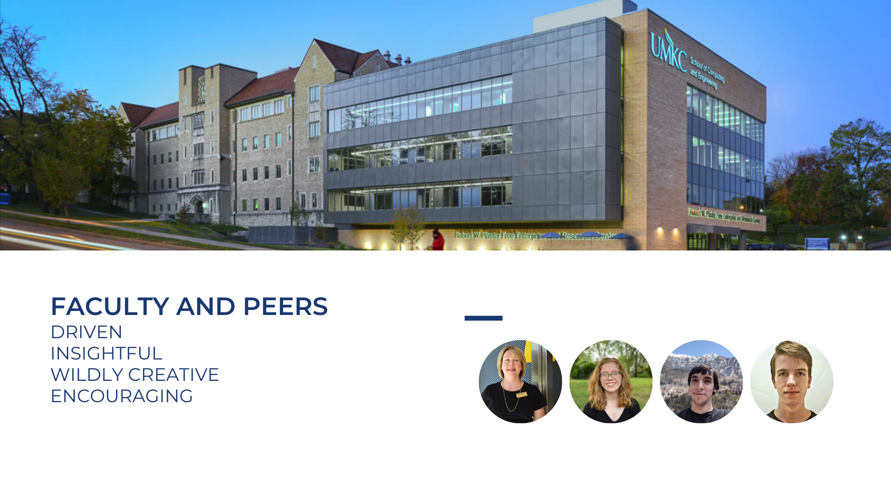
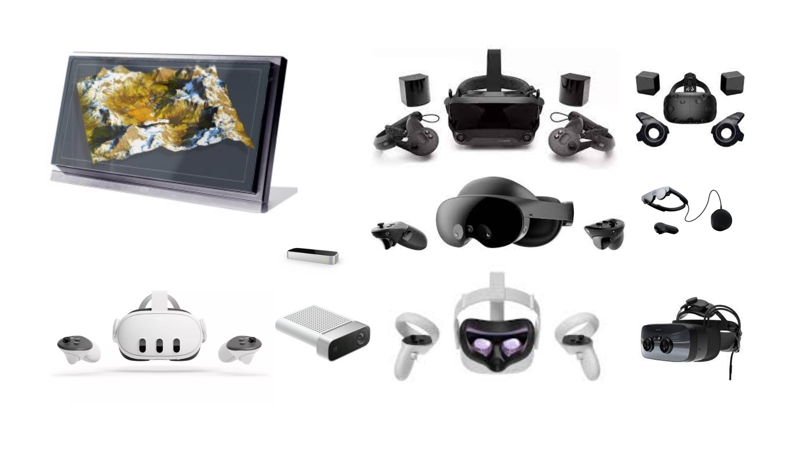
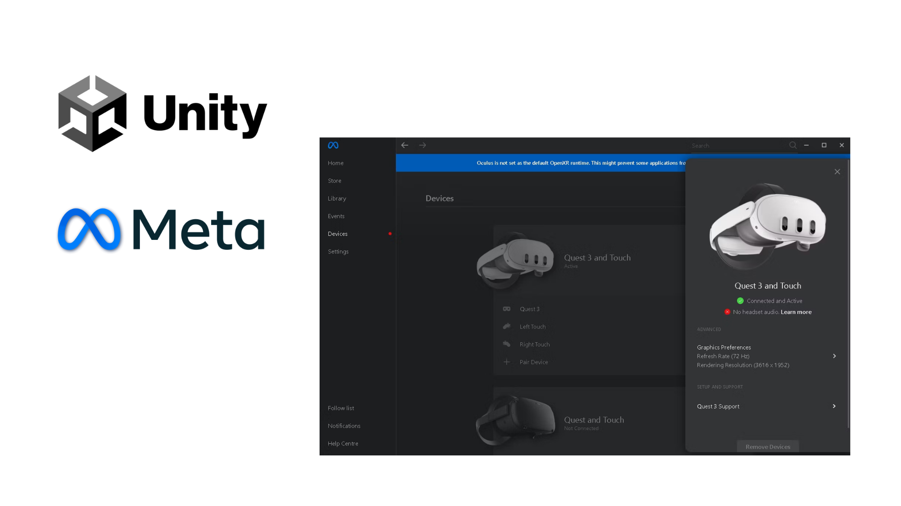
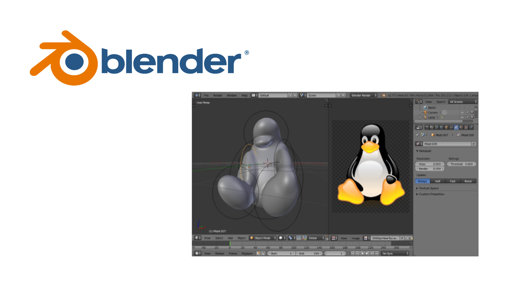
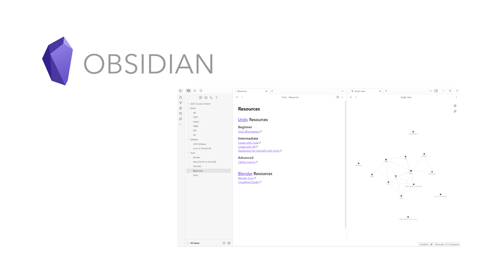
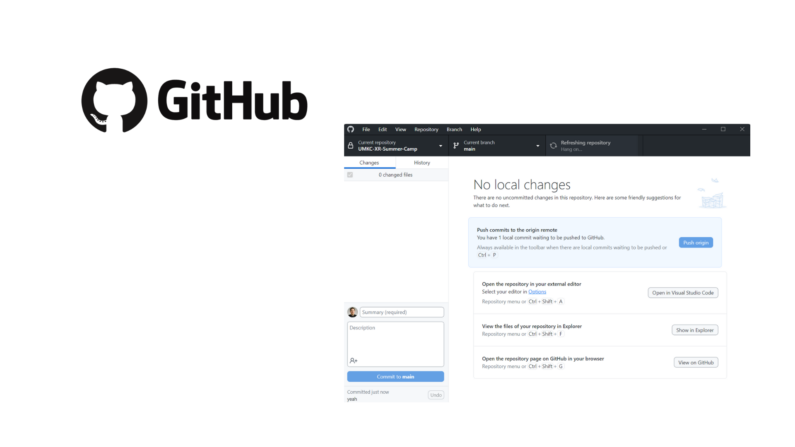

# UMKC XR Summer Camp 2024

Welcome to the UMKC XR Summer Camp! This program is designed to immerse students in the exciting world of virtual and augmented reality. By the end of this camp, students will have a solid foundation in Unity and the skills necessary to create their own immersive experiences.

## Schedule for June 2024

### 19th, Wednesday
**Event:** Introduction to VR and AR  
**Time:** 7:30am - 8:30am  
**Homework:** Install all the tools: Unity, GitHub, Obsidian, Blender

### 20th, Thursday
**Event:** VR Tools and Pre-Study  
**Time:** 8:30am - 9:00am  
**Homework:** Complete one (or more) Unity Microgame(s)

### 24th, Monday
**Event:** Meta world Game / Training / Tour Devices play  
**Time:** 2:00pm - 3:00pm  
**Event:** Students share their experiences and thoughts  
**Time:** 3:00pm - 3:20pm  
**Event:** Project 1: Virtual Reality Unity “Build the research lab”  
**Time:** 3:30pm - 4:30pm  
**Homework:** Pull the Starter Project repository.

### 25th, Tuesday
**Event:** VR Project hands-on: Build an interactive environment  
**Time:** 1:30pm - 2:30pm  

### 26th, Wednesday
**Event:** VR Project hands-on: Controls  
**Time:** 2:00pm - 3:30pm  

### 27th, Thursday
**Event:** VR Project hands-on: Build to a VR Headset  
**Time:** 10:00am - 11:00am  

## Resources

### Hardware

### Unity
- **Beginner:** Unity Microgames
- **Intermediate (optional):** Create with Code
- **Advanced (optional):** Create with VR, Developing for VisionOS with Unity

### GitHub
- **Starter Project:**

### Obsidian
- **Installation and Setup:** [Obsidian](https://obsidian.md)

### Blender
- **Installing Blender:** [Blender](https://www.blender.org)

<table>
  <tr>
    <td style="text-align: center;">
       
    </td>
    <td style="text-align: center;">
       
    </td>
  </tr>
  <tr>
    <td style="text-align: center;">
       
    </td>
    <td style="text-align: center;">
       
    </td>
  </tr>
</table>

## Learning Approach

1. **Project-Based Learning:** Hands-on projects to apply theoretical knowledge.
2. **Collaborative Learning:** Group activities and sharing sessions to enhance peer learning.
3. **Adaptive Learning:** Customized assignments and tasks based on individual progress and interest.
4. **Reflective Practice:** Encouraging students to reflect on their experiences and learning process.

We aim to create an engaging and supportive environment where students can explore, create, and innovate in the field of XR technology.
